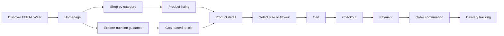
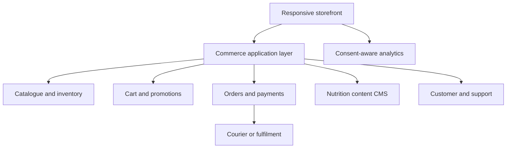

# FERAL Wear — Product & Delivery Flow

## 1. Product goal

FERAL Wear will be a premium, performance-led commerce platform that combines sportswear, supplements, and practical nutrition guidance in one brand experience. The first release focuses on a conversion-ready homepage; inner journeys will be designed iteratively after visual approval.

## 2. Brand direction derived from the logo

- Visual character: sharp, disciplined, minimal, energetic.
- Core palette: carbon black, warm bone-white, stone grey, and a controlled acid-lime accent for actions and status.
- Shape language: angular cuts, tall condensed display type, precise grid lines, and tactile fabric/grain texture.
- Voice: direct, confident, concise, never exaggerated.
- Accessibility: readable contrast, visible focus states, keyboard-friendly controls, motion reduction support, and semantic page structure.

## 3. Prerequisites

- Approved logo and brand name: FERAL Wear.
- Product catalogue data: SKU, category, title, price, discount, sizes/flavours, inventory, images, ingredients/materials, care/use instructions.
- Commercial rules: currency, tax, delivery regions, shipping thresholds, returns and refund policy.
- Payments: preferred provider and merchant account.
- Fulfilment: courier integration or manual order workflow.
- Nutrition content governance: qualified reviewer, disclaimers, sources, review dates, and prohibited medical claims.
- Legal pages: privacy, terms, cookies, returns, supplement disclaimer, and contact details.
- Analytics: consent policy, conversion events, and reporting owner.
- Customer service: email/WhatsApp, support hours, and escalation process.

## 4. Customer flow

## 5. Application architecture

## 6. Planned information architecture

1. Home
2. Shop
   - Performance wear
   - Supplements
   - Accessories
3. Product details
4. Nutrition guidance
   - Goals
   - Meal guidance
   - Supplement education
5. Cart and checkout
6. Account
   - Orders
   - Addresses
   - Saved items
7. Support, policies, and legal pages

## 7. Homepage scope — phase 1

- Announcement bar and responsive navigation.
- Premium hero section with two primary routes.
- Trust/performance metrics.
- Category cards for wear, supplements, and nutrition.
- Interactive featured-products rail with category filters and working demo cart.
- Editorial brand manifesto and newsletter capture.
- Full footer with future-route placeholders.
- Responsive behaviour for desktop, tablet, and mobile.

## 8. Data plan

Phase 1 uses clearly fictional demo catalogue content. Production data will later move to a catalogue database/CMS with server-side price and inventory validation. Cart state in the first page is intentionally device-local and non-transactional.

## 9. Quality assurance plan

- Static: type checking, production build, linting, semantic HTML review, metadata review, broken-reference check.
- Functional: filters, add-to-cart count, newsletter validation, navigation targets, keyboard focus.
- Responsive: desktop, tablet, and mobile viewport checks.
- Accessibility: headings, landmarks, labels, contrast, focus visibility, reduced-motion behaviour.
- Performance: image sizing/loading strategy, minimal client state, layout stability.
- Security for later full stack: server-side validation, secure sessions, CSRF protection, rate limits, payment-provider hosted fields, secrets management, dependency scanning, and audit logging.
- Commerce QA for later phases: price/inventory race conditions, promotion rules, checkout failure/retry, idempotent order creation, refunds, and fulfilment status transitions.

## 10. Delivery phases

1. Brand system + homepage prototype and QA.
2. Catalogue, search, filters, and product pages.
3. Cart, checkout, payment, and order workflow.
4. Accounts, saved products, support, and nutrition CMS.
5. Security review, performance hardening, analytics, content/legal approval, and production launch.

## 11. Phase-1 acceptance criteria

- Logo-led visual identity is consistent across the page.
- Homepage works at 375 px, 768 px, and desktop widths.
- Product filtering and demo cart interactions work without errors.
- Page is keyboard navigable and respects reduced motion.
- Production build and automated tests pass.
- Demo product and health content is not presented as verified medical advice.
